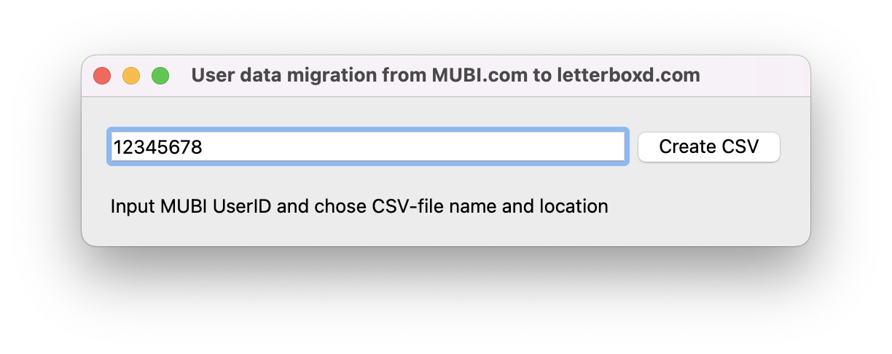

# mubi2letterboxd

## What?
_mubi2letterboxd_ is a simple GUI application for user data migration from [MUBI](https://mubi.com) to [letterboxd](https://letterboxd.com). With the utility, you can create a [.csv file](https://letterboxd.com/about/importing-data/) suitable for manual [import](https://letterboxd.com/import/) to Letterboxd.

## Why?
If you have an account on MUBI, the mubi2letterboxd utility can help you easily import your data to [letterboxd](https://letterboxd.com). 

## How?
Open your profile page on MUBI. Examine your browser address line to find out your UserID. UserID is a number at the end of the site address.


Then input UserID to the application window.

# Quick start
## Install dependencies
```shell
pip install -r requirements.txt
````

## Run application
```shell
python mubi2letterboxd.py
```


Those who prefer command line interface can refer to the similar [mubi2letterboxd](https://github.com/hextriclosan/mubi2letterboxd) application I wrote in Golang.


# Maintain

## Install

### Create environment
You can create environment either with virtualenv or pyenv.

#### Virtualenv
Before it, you need to install [pyenv](https://github.com/pyenv/pyenv) and [pyenv-virtualenv](https://github.com/pyenv/pyenv-virtualenv) for your OS.
```shell
virtualenv venv
source ./venv/bin/activate
```

#### Pyenv
```shell
pyenv virtualenv 3.9.1 mubi2letterboxd
pyenv activate mubi2letterboxd
```

### Install requirements
You can use either Poetry or Pip
#### Poetry
```shell
pip install -U pip poetry
poetry install
```

#### Pip
```shell
pip install -r requirements.txt
```

## Use linters

### Install pre-commit hooks
```shell
pre-commit install
```

### Use pre-commit hooks
Before each commit call `make lint`. After installing libs call `make update-isort` 