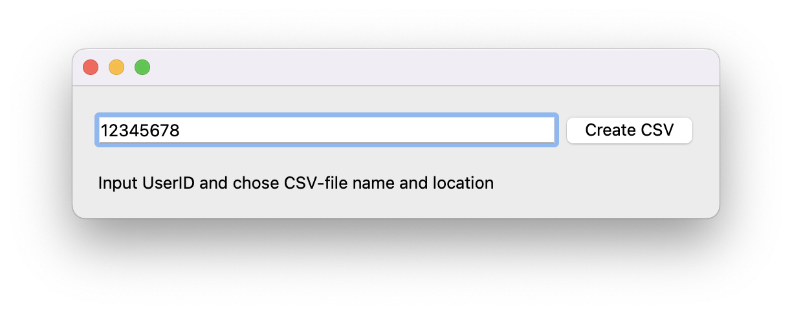

# mubi2letterboxd

## What?
_mubi2letterboxd_ is a simple command line utility for user data migration from [MUBI](https://mubi.com) to [letterboxd](https://letterboxd.com). With the utility, you can create a [.csv file](https://letterboxd.com/about/importing-data/) suitable for manual [import](https://letterboxd.com/import/) to Letterboxd.

## Why?
If you have an account on MUBI, the mubi2letterboxd utility can help you easily import your data to [letterboxd](https://letterboxd.com). 

## How?
Open your profile page on MUBI. Examine your browser address line to find out your UserID. UserID is a number at the end of the site address.

Then input UserID to the application window. 

### Install dependencies and run
`python3 -m pip install -r requirements.txt`

`python3 mubi2letterboxd.py`

Those who prefer command line interface can refer to the similar [mubi2letterboxd](https://github.com/hextriclosan/mubi2letterboxd) application I wrote in Golang.